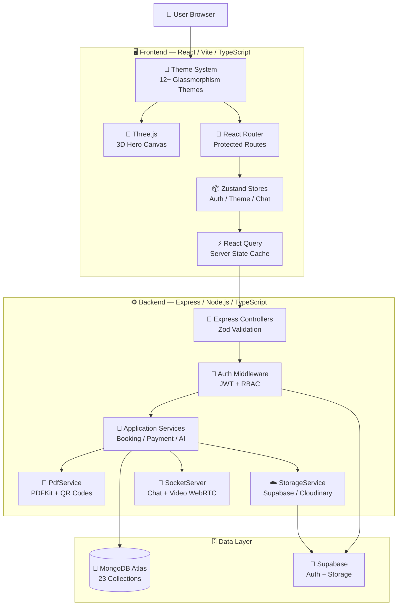
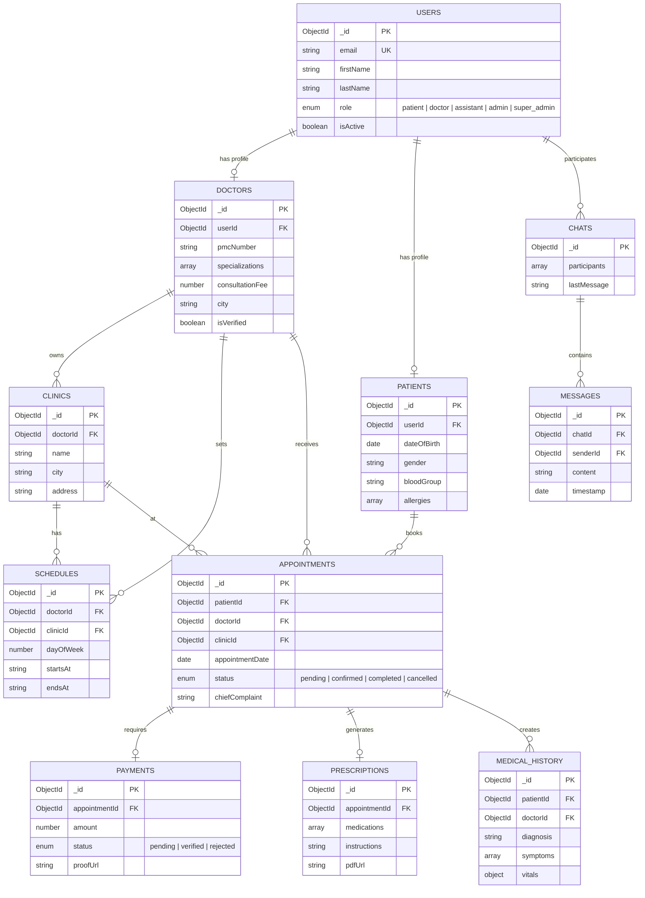
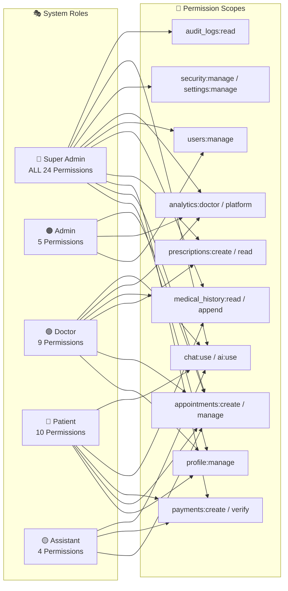
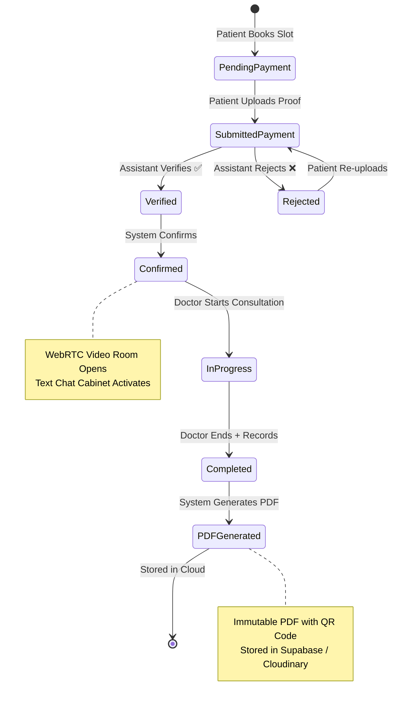

<div align="center">

# 🏥 DoctorHub AI

### Enterprise Healthcare Ecosystem

[](https://docterapp.vercel.app/)
[](https://github.com/Arslan-web-Dev/doctorhub-healthcare-platform)
[](https://nodejs.org/)
[](https://www.typescriptlang.org/)
[](https://www.mongodb.com/)
[](LICENSE)

An enterprise-grade, AI-powered healthcare ecosystem featuring 5-role RBAC authentication, interactive 3D elements, 12+ dynamic themes, real-time consultation rooms, and immutable PDF medical record generation.

**[🌐 Live Demo](https://docterapp.vercel.app/)** · **[📧 Contact](mailto:muhammadarslan.cs.web@gmail.com)** · **[🐛 Report Bug](https://github.com/Arslan-web-Dev/doctorhub-healthcare-platform/issues)**

</div>

---

## 🔑 Demo Accounts

> **Try the live app instantly with these pre-configured test accounts:**

| Role | Email | Password | Access Level |
|------|-------|----------|--------------|
| 🔴 **Super Admin** | `admin@doctorhub.local` | `Admin@123` | Full system control, all permissions |
| 🟠 **Admin** | `admin2@doctorhub.local` | `Admin@123` | User management, doctor verification |
| 🟢 **Doctor** | `doctor@doctorhub.local` | `Doctor@123` | Patient records, prescriptions, analytics |
| 🔵 **Patient** | `patient@doctorhub.local` | `Patient@123` | Book appointments, view records, AI chat |
| 🟡 **Assistant** | `assistant@doctorhub.local` | `Assistant@123` | Payment verification, queue management |

> [!TIP]
> Register a new account to experience the full onboarding flow, or use the demo accounts above to explore each role's unique dashboard immediately.

---

## ✨ Key Features

<table>
<tr>
<td width="50%">

### 🎨 Frontend
- 🌗 **12+ Dynamic Themes** — Glassmorphism UI with live theme switcher
- 🧊 **3D Interactive Hero** — Three.js medical models with parallax
- 📱 **Fully Responsive** — Mobile-first design across all pages
- ⚡ **Framer Motion** — Smooth page transitions & micro-animations
- 🧠 **AI Chatbot** — Intelligent symptom checker & health assistant

</td>
<td width="50%">

### ⚙️ Backend
- 🔐 **5-Role RBAC** — Granular permission system (24 permissions)
- 🔑 **Hybrid Auth** — JWT + Supabase authentication
- 📄 **PDF Generation** — Immutable prescriptions with QR verification
- 💬 **Real-Time** — Socket.io chat & WebRTC video consultations
- 🗄️ **MongoDB Atlas** — Cloud database with Mongoose ODM

</td>
</tr>
</table>

---

## 🏛️ System Architecture



---

## 📊 Database Schema (ERD)



---

## 🔐 RBAC Permission Matrix



| Permission | Patient | Doctor | Assistant | Admin | Super Admin |
|------------|:-------:|:------:|:---------:|:-----:|:-----------:|
| `profile:manage` | ✅ | ✅ | — | — | ✅ |
| `appointments:create` | ✅ | — | — | — | ✅ |
| `appointments:manage_own` | ✅ | ✅ | — | — | ✅ |
| `appointments:verify` | — | — | ✅ | — | ✅ |
| `appointments:manage_all` | — | — | — | ✅ | ✅ |
| `payments:create` | ✅ | — | — | — | ✅ |
| `payments:verify` | — | — | ✅ | — | ✅ |
| `prescriptions:create` | — | ✅ | — | — | ✅ |
| `prescriptions:read_own` | ✅ | — | — | — | ✅ |
| `medical_history:read_own` | ✅ | — | — | — | ✅ |
| `medical_history:read_assigned` | — | ✅ | — | — | ✅ |
| `medical_history:append` | — | ✅ | — | — | ✅ |
| `reports:upload` | ✅ | — | — | — | ✅ |
| `reports:manage` | — | — | ✅ | ✅ | ✅ |
| `doctors:read` | ✅ | ✅ | — | — | ✅ |
| `doctors:manage` | — | — | — | ✅ | ✅ |
| `users:manage` | — | — | — | ✅ | ✅ |
| `chat:use` | ✅ | ✅ | ✅ | — | ✅ |
| `ai:use` | ✅ | ✅ | — | — | ✅ |
| `analytics:doctor` | — | ✅ | — | — | ✅ |
| `analytics:platform` | — | — | — | ✅ | ✅ |
| `security:manage` | — | — | — | — | ✅ |
| `settings:manage` | — | — | — | — | ✅ |
| `audit_logs:read` | — | — | — | — | ✅ |

---

## 🔄 Appointment Workflow



---

## 🛠️ Tech Stack

| Layer | Technology | Purpose |
|-------|-----------|---------|
| **Frontend** | React 18 + TypeScript | UI Framework |
| **Styling** | Tailwind CSS + Glassmorphism | Responsive Design |
| **3D Graphics** | Three.js | Interactive Hero Section |
| **Animations** | Framer Motion | Page Transitions |
| **State** | Zustand + React Query | Client & Server State |
| **Routing** | React Router v7 | SPA Navigation |
| **Backend** | Express.js + TypeScript | REST API Server |
| **Auth** | JWT + Supabase | Hybrid Authentication |
| **Database** | MongoDB Atlas + Mongoose | Data Persistence |
| **Storage** | Supabase Storage / Cloudinary | File & Image Hosting |
| **Real-Time** | Socket.io + WebRTC | Chat & Video Calls |
| **PDF** | PDFKit | Medical Record Generation |
| **Validation** | Zod | Schema Validation |
| **Testing** | Vitest | Unit Testing |
| **Frontend Hosting** | Vercel | CDN + Edge |
| **Backend Hosting** | Railway | Container Deployment |

---

## 📁 Project Structure

```
doctorhub-healthcare-platform/
├── 📂 frontend/                    # React + Vite + TypeScript
│   ├── 📂 src/
│   │   ├── 📂 components/          # Reusable UI components
│   │   │   ├── 📂 layout/          #   Shell, Navbar, Sidebar
│   │   │   └── 📂 ui/              #   Button, Panel, Input, Modal
│   │   ├── 📂 features/            # Feature-based modules
│   │   │   ├── 📂 auth/            #   Login / Register pages
│   │   │   ├── 📂 dashboards/      #   5 Role-specific dashboards
│   │   │   ├── 📂 doctors/         #   Doctor listing & profiles
│   │   │   ├── 📂 ai/              #   AI Chatbot & Symptom Checker
│   │   │   └── 📂 public/          #   Landing page (3D Hero)
│   │   ├── 📂 stores/              # Zustand state management
│   │   ├── 📂 lib/                 # Utilities & API client
│   │   └── 📄 index.css            # Theme system (12+ themes)
│   └── 📄 tailwind.config.ts
│
├── 📂 backend/                     # Express + TypeScript
│   ├── 📂 src/
│   │   ├── 📂 config/              # Environment & Zod validation
│   │   ├── 📂 domain/              # Business logic & entities
│   │   │   └── 📂 entities/        #   Roles, Permissions
│   │   ├── 📂 application/         # Application services
│   │   │   └── 📂 services/        #   Auth, PDF, Storage, AI
│   │   ├── 📂 infrastructure/      # External adapters
│   │   │   ├── 📂 database/        #   MongoDB models & connection
│   │   │   └── 📂 realtime/        #   Socket.io server
│   │   └── 📂 interfaces/          # HTTP layer
│   │       └── 📂 http/            #   Routes, Controllers, Middleware
│   ├── 📂 scripts/                 # Database seeding
│   └── 📂 tests/                   # Vitest test suites
│
├── 📄 package.json                 # Monorepo workspace config
├── 📄 vercel.json                  # Frontend deployment
├── 📄 railway.toml                 # Backend deployment
└── 📄 README.md                    # You are here! 👋
```

---

## ⚡ Quick Start

### Prerequisites

- **Node.js** v20 or higher
- **npm** v9 or higher
- **MongoDB** Atlas account (or local MongoDB instance)

### Installation

```bash
# 1. Clone the repository
git clone https://github.com/Arslan-web-Dev/doctorhub-healthcare-platform.git
cd doctorhub-healthcare-platform

# 2. Install all dependencies (monorepo workspace)
npm install

# 3. Configure environment variables
cp backend/.env.example backend/.env
cp frontend/.env.example frontend/.env
# Edit both .env files with your credentials

# 4. Start development servers
npm run dev:backend    # → http://localhost:5000
npm run dev:frontend   # → http://localhost:5173
```

### 🌱 Database Seeding

Populate the database with sample data (doctors, patients, appointments, etc.):

```bash
cd backend
npx tsx scripts/seed.ts
```

> [!NOTE]
> Make sure your `MONGODB_URI` in `backend/.env` is correctly configured before running the seed script. The script will clear existing data and insert fresh sample records.

---

## 🚀 Deployment

| Service | Platform | Status |
|---------|----------|--------|
| **Frontend** | [Vercel](https://vercel.com) | ✅ [Live](https://docterapp.vercel.app/) |
| **Backend** | [Railway](https://railway.app) | ✅ Deployed |
| **Database** | [MongoDB Atlas](https://cloud.mongodb.com) | ✅ Connected |
| **Auth + Storage** | [Supabase](https://supabase.com) | ✅ Active |

---

## 📬 Contact

<div align="center">

**Muhammad Arslan** — Full Stack Developer

[](mailto:muhammadarslan.cs.web@gmail.com)
[](https://github.com/Arslan-web-Dev)
[](https://linkedin.com/in/arslan-web-dev)

📧 **muhammadarslan.cs.web@gmail.com** · 📱 **+92 327 5541708**

</div>

---

<div align="center">

### ⭐ Star this repository if you found it helpful!

Made with ❤️ by **Muhammad Arslan**

© 2026 DoctorHub AI. All rights reserved.

</div>
