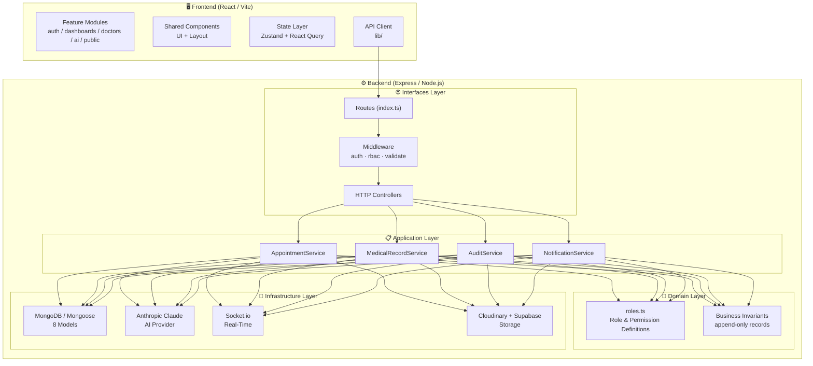
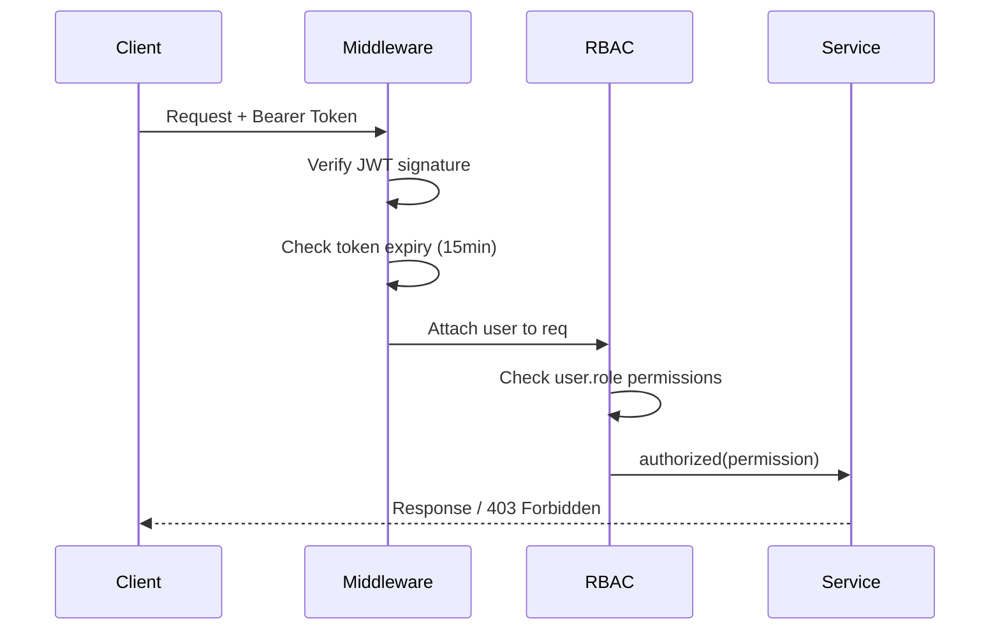

# 🏛️ Architecture Overview

**DoctorHub AI** is built on **Clean Architecture** principles, ensuring that business rules are independent of frameworks, databases, and external services. This makes the codebase highly testable, maintainable, and adaptable.

---

## 🧱 Layer Diagram



---

## 📐 Layer Responsibilities

### 🧠 Domain Layer
**Location:** `backend/src/domain/`

The innermost layer. Contains **pure business logic** with zero external dependencies.

- **`entities/roles.ts`** — Defines the 5 roles and 24 permissions. The single source of truth for RBAC.
- **Business Invariants:**
  - Medical history is **append-only** (never mutated post-creation)
  - Prescriptions are **append-only**
  - Appointment confirmation requires payment verification
  - AI features must include a medical disclaimer
  - Every sensitive action writes an audit log

### 📋 Application Layer
**Location:** `backend/src/application/services/`

Orchestrates domain rules and coordinates infrastructure. Contains **use case implementations**.

| Service | Responsibility |
|---------|---------------|
| `AppointmentService` | Booking, payment upload, verification, confirmation lifecycle |
| `MedicalRecordService` | Appending history, creating prescriptions, PDF generation |
| `AuditService` | Writing immutable audit log entries for sensitive operations |
| `NotificationService` | Sending in-app notifications (Socket.io events) |

### 🔌 Infrastructure Layer
**Location:** `backend/src/infrastructure/`

Adapters that connect the application to external systems.

| Adapter | Directory | Purpose |
|---------|-----------|---------|
| MongoDB + Mongoose | `database/` | 8 models across 23 collections |
| Anthropic Claude | `ai/` | AI health assistant integration |
| Socket.io | `realtime/` | Real-time chat and WebRTC signaling |
| Cloudinary + Supabase | `storage/` | File and image storage |

### 🌐 Interfaces Layer
**Location:** `backend/src/interfaces/http/`

The HTTP boundary. Translates HTTP concerns to/from application use cases.

| Component | File | Responsibility |
|-----------|------|---------------|
| Auth middleware | `middleware/auth.middleware.ts` | JWT verification |
| RBAC middleware | `middleware/rbac.middleware.ts` | Permission enforcement |
| Validate middleware | `middleware/validate.middleware.ts` | Zod schema validation |
| Controllers | `controllers/*.ts` | Request/response handling |
| Routes | `routes/index.ts` | URL-to-controller mapping |

---

## 🎨 Frontend Architecture

**Location:** `frontend/src/`

The frontend follows a **feature-based module structure** — each feature owns its own pages, components, hooks, and API calls.

```
src/
├── app/           → Router setup, app shell
├── components/    → Shared, reusable UI (Button, Modal, Input, Navbar, Sidebar)
├── features/      → Self-contained feature modules
│   ├── auth/      → Login, Register, token management
│   ├── dashboards/→ 5 role-specific dashboards
│   ├── doctors/   → Doctor search, profiles, scheduling
│   ├── ai/        → AI chatbot widget, symptom checker
│   └── public/    → Landing page with 3D Three.js hero
├── stores/        → Zustand global state (auth, theme, chat)
└── lib/           → Axios API client, utilities
```

---

## 🔐 Security Architecture



---

## 🏥 Non-Negotiable Business Rules

These rules are enforced at the **application layer** and must never be bypassed:

1. **Medical history is append-only** — `appendHistory()` only creates new documents
2. **Prescriptions are append-only** — PDF is generated once and stored immutably
3. **Appointment confirmation requires payment verification** — Assistant must verify first
4. **Every sensitive action writes an audit log** — `AuditService.log()` is called in every sensitive service method
5. **AI features provide guidance only** — All AI responses include a mandatory medical disclaimer; AI must not diagnose or prescribe

---

## 🚀 Deployment Architecture

```
┌─────────────────────────────────────────────────────────┐
│                     Users (Global CDN)                   │
└───────────────────┬─────────────────────────────────────┘
                    │
          ┌─────────▼──────────┐
          │   Vercel Edge CDN  │  ← React SPA (static assets)
          │  (frontend build)  │
          └─────────┬──────────┘
                    │ HTTPS API calls
          ┌─────────▼──────────┐
          │  Railway Container │  ← Express API server
          │  (Node.js backend) │
          └─────────┬──────────┘
                    │
        ┌───────────┼───────────┐
        │           │           │
   ┌────▼────┐ ┌────▼────┐ ┌───▼──────┐
   │ MongoDB │ │Supabase │ │Cloudinary│
   │  Atlas  │ │Auth+Store│ │  Media  │
   └─────────┘ └─────────┘ └──────────┘
```
