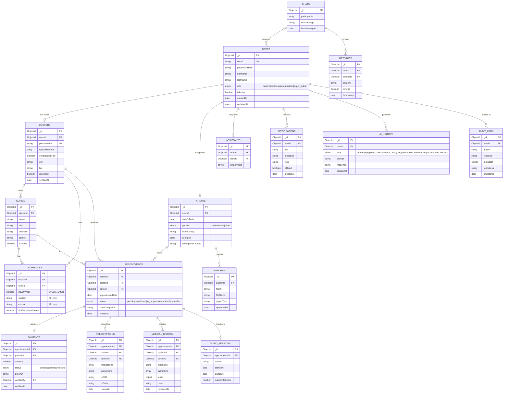

# 📊 Entity Relationship Diagram

Full ERD for the **DoctorHub AI** database schema across all 23 MongoDB collections.

---

## Core ERD

---

## 📋 Model Summary

| Mongoose Model | File | Key Fields |
|---------------|------|-----------|
| `User` | `User.model.ts` | email, role, passwordHash |
| `Doctor` | `Doctor.model.ts` | userId, pmcNumber, specializations, isVerified |
| `Patient` | `Patient.model.ts` | userId, dateOfBirth, bloodGroup |
| `Appointment` | `Appointment.model.ts` | patientId, doctorId, status, appointmentDate |
| `Prescription` | `Prescription.model.ts` | appointmentId, medications, pdfUrl, qrCode |
| `MedicalHistory` | `MedicalHistory.model.ts` | patientId, diagnosis, vitals, symptoms |
| `Payment` | `Operational.model.ts` | appointmentId, proofUrl, status |
| `Platform` | `Platform.model.ts` | Clinics, Schedules, Notifications, AI History, Audit Logs |

---

## 🔑 Key Design Decisions

1. **Append-only medical records** — `MedicalHistory` and `Prescription` documents are never updated. New appointments create new entries.
2. **Unified User model** — All roles share a single `User` document; role-specific data lives in separate models (`Doctor`, `Patient`).
3. **Payment-first flow** — Appointments cannot be confirmed without payment verification, enforced at the service layer.
4. **Audit logs** — Every sensitive action (prescription creation, payment verification, user management) creates an `AuditLog` document.
5. **AI history** — All AI interactions are persisted for compliance and analytics.
